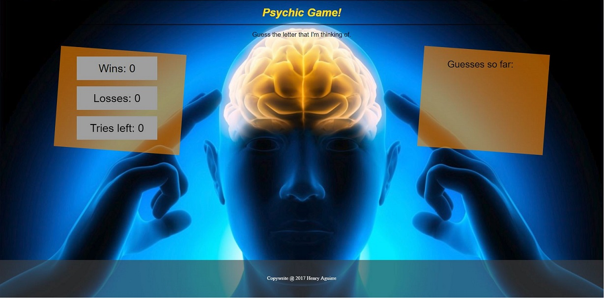

# Psychic-Game
Press key to guess the randomly selected answer.

## Game Flow 
Computer randomly a pickes letter.
The user can then use the keyboard to guess any letter between a-z. There are only 9 tries before the game resets, adds one to to the losses and picks another letter to guess

## How To Play
Click [here](https://aguirreh8.github.io/Psychic-Game/) to lauch the app, or clone the repo into your desktop and run **index.html**.

## Author
Henry Aguirre